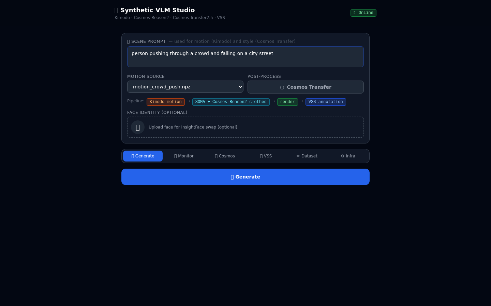

# VisionAI-Flywheel

> **Synthetic → Real → Fine-Tune**  
> End-to-end pipeline for generating annotated surveillance video training data for VLM fine-tuning.



## Overview

VisionAI-Flywheel is a data flywheel for surveillance AI:
1. **Generate** — describe a scene in natural language → synthetic video via Kimodo + SOMA
2. **Enhance** — optionally apply Cosmos-Transfer2.5 Sim2Real diffusion for photorealism
3. **Annotate** — auto-annotate via NVIDIA VSS (VLM) + human correction
4. **Fine-tune** — export curated (video, annotation) pairs for VLM training

## Pipeline

```
Scene Prompt  (e.g. person pushing through a crowd and falling on a city street)
     │
     ▼
[Kimodo]  Text → 3D Motion  (SOMA 77-joint skeleton, NPZ + BVH)
     │
     ▼
[SOMA Render]  Clothed mesh video
  · Clothing colors parsed from natural language  (e.g. grey shirt, dark trousers)
  · Optional: face swap via InsightFace
     │
     ├── Cosmos Transfer OFF ──► clothed_render.mp4
     │
     └── Cosmos Transfer ON  ──► [Cosmos-Transfer2.5] Sim2Real diffusion
                                   (Canny edge control, 2B model, GPU1)
                                   └──► photorealistic.mp4
     │
     ▼
[VSS / NVIDIA VLM]  Auto-annotation  →  VLMAnnotation DB
  · Stores: video_filename, vss_response, user_annotation, tags, tuning_status
```

## Studio UI

The **Synthetic VLM Studio** is a web app for managing the full pipeline:

| Tab | Description |
|-----|-------------|
| **Generate** | Scene prompt → motion → clothed render → VSS annotation |
| **Monitor** | Live job logs + progress |
| **Cosmos** | Side-by-side edge control vs. Sim2Real output |
| **VSS** | Query VSS VLM directly |
| **Dataset** | Browse annotated training pairs |
| **Infra** | Docker container health status |

## Services

| Service | Port | GPU | Description |
|---------|------|-----|-------------|
| VSS Agent | 8000 | shared | Video Search & Summarization chat API |
| VST Ingress | 77770 | — | Video ingest + storage |
| Nemotron-Nano-9B NIM | 30081 | GPU0 | LLM backbone for VSS |
| Render API | 9000 | GPU0 | FastAPI: , , ,  |
| Cosmos-Transfer2.5 | 8080 | GPU1 | Sim2Real video diffusion (Docker container) |

> **Note:** Cosmos-Reason2-8B NIM is no longer required for clothing texture generation.
> Color parsing is handled locally via keyword matching (no external API calls).

## Hardware

- 2× NVIDIA RTX PRO 6000 Blackwell Server Edition (~102 GB VRAM each)
- GPU0: VSS stack + Kimodo text-encoder + Render API
- GPU1: Cosmos Transfer2.5 (persistent container)

## Quick Start

```bash
# 1. Clone with submodules
git clone --recurse-submodules https://github.com/EyalEnav/VisionAI-Flywheel.git
cd VisionAI-Flywheel

# 2. Set environment secrets
cp deployments/vss/env.rtxpro6000bw .env
# Fill in: NGC_CLI_API_KEY, HF_TOKEN

# 3. Create Docker network
docker network create vlm-net

# 4. Start VSS stack (NVIDIA MDX blueprint)
cd deployments/vss
docker compose --profile bp_developer_base_2d up -d

# 5. Start Render API (Kimodo + SOMA rendering)
cd ../../services/render-api
docker compose up -d

# 6. Build & start Cosmos Transfer (optional, GPU1)
cd ../cosmos-transfer
./build.sh        # builds cosmos-transfer:local image (~20 min first time)
docker compose up -d

# 7. Open Studio UI
# https://kostya-app-309de312.base44.app
```

## Dependencies & Credits

| Component | Source |
|-----------|--------|
| **NVIDIA VSS Blueprint 3.1** | [github.com/NVIDIA/video-search-and-summarization](https://github.com/NVIDIA/video-search-and-summarization) |
| **Kimodo** (text → motion) | [github.com/NVlabs/Kimodo](https://github.com/NVlabs/Kimodo) |
| **Cosmos-Transfer2.5** (Sim2Real) | [github.com/NVIDIA/Cosmos-Transfer2](https://github.com/NVIDIA/Cosmos-Transfer2) |
| **SOMA** (mesh skinning) | NVlabs / SOMA |
| **InsightFace** (face swap) | [github.com/deepinsight/insightface](https://github.com/deepinsight/insightface) |

## License

This project is released under the [Apache 2.0 License](LICENSE).

**Third-party components** retain their original licenses:
- NVIDIA VSS Blueprint 3.1 — [NVIDIA License](https://github.com/NVIDIA/video-search-and-summarization/blob/main/LICENSE)
- Cosmos-Transfer2 — [Apache 2.0 / NVIDIA Open Model License](https://github.com/NVIDIA/Cosmos-Transfer2/blob/main/LICENSE)
- Kimodo — subject to NVlabs license terms

> **Disclaimer:** This software is provided as is, without warranty of any kind, express or implied.  
> The authors and contributors shall not be held liable for any direct, indirect, incidental, special, exemplary, or consequential damages arising from the use of this software.  
> Use responsibly and in compliance with all applicable laws and the terms of all upstream NVIDIA repositories.
