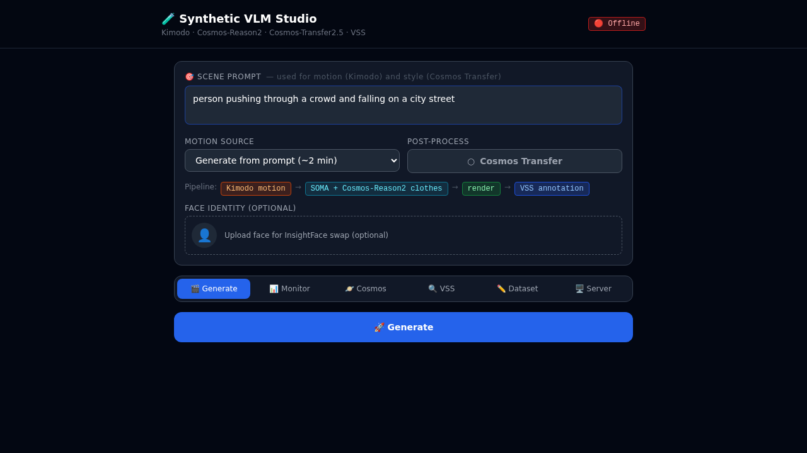

# VisionAI-Flywheel

> **Synthetic → Real → Fine-Tune**  
> End-to-end pipeline for generating annotated surveillance video training data for VLM fine-tuning.



## Pipeline

```
Scene Prompt
     │
     ├── [Kimodo] Text → 3D Motion (SOMA skeleton, 77 joints)
     │
     ├─ Transfer OFF ─► [Cosmos-Reason2] Prompt → RGB clothing colors
     │                   └─► [SOMA Render] Clothed mesh video
     │
     └─ Transfer ON ──► [SOMA Render] Skeleton-only video
                         └─► [Cosmos-Transfer2.5] Sim2Real diffusion
                              (Canny edge control, 2B model)
     │
     └── [VSS / Cosmos-Reason2] Auto-annotation → VLMAnnotation DB
```

## Dependencies & Credits

| Component | Source |
|-----------|--------|
| **NVIDIA VSS Blueprint 3.1** | [github.com/NVIDIA/video-search-and-summarization](https://github.com/NVIDIA/video-search-and-summarization) |
| **Kimodo** (text → motion) | [github.com/NVlabs/Kimodo](https://github.com/NVlabs/Kimodo) |
| **Cosmos-Transfer2** (Sim2Real) | [github.com/NVIDIA/Cosmos-Transfer2](https://github.com/NVIDIA/Cosmos-Transfer2) |
| **SOMA** (mesh skinning) | NVlabs / SOMA |

## Services

| Service | Port | GPU | Description |
|---------|------|-----|-------------|
| VSS Agent | 8000 | shared | Video Search & Summarization chat API |
| VST Ingress | 77770 | - | Video ingest + storage |
| Cosmos-Reason2-8B NIM | 30082 | GPU0 shared | VLM for texture generation + annotation |
| Nemotron-Nano-9B NIM | 30081 | GPU0 shared | LLM backbone |
| Kimodo text-encoder | 9550 | GPU0 | LLM2Vec + Llama-3-8B motion synthesis |
| Cosmos-Transfer2.5 | Docker ephemeral | GPU1 | Sim2Real video diffusion |
| Render API | 9000 | GPU0 | FastAPI: /generate, /jobs, /status |

## Hardware

- 2× NVIDIA RTX PRO 6000 Blackwell Server Edition (~102 GB VRAM each)
- GPU0: VSS stack + Kimodo + Render API
- GPU1: Cosmos Transfer2.5 (ephemeral Docker)

## Quick Start

```bash
# 1. Set secrets
cp .env.example .env
# Fill in NGC_CLI_API_KEY, HF_TOKEN

# 2. Start VSS stack (NVIDIA MDX blueprint)
cd deployments/vss
docker compose --profile bp_developer_base_2d up -d

# 3. Start Kimodo motion synthesis
cd ../../services/kimodo
docker compose up -d

# 4. Start Render API
cd ../render-api
docker compose up -d

# 5. Run Cosmos Transfer (on-demand, per video)
cd ../cosmos-transfer
./run.sh input.mp4 "your scene prompt" output.mp4
```

## License

This project is released under the [Apache 2.0 License](LICENSE).

**Third-party components** retain their original licenses:
- NVIDIA VSS Blueprint 3.1 — [NVIDIA License](https://github.com/NVIDIA/video-search-and-summarization/blob/main/LICENSE)
- Cosmos-Transfer2 — [Apache 2.0 / NVIDIA Open Model License](https://github.com/NVIDIA/Cosmos-Transfer2/blob/main/LICENSE)
- Kimodo — subject to NVlabs license terms

> **Disclaimer:** This software is provided "as is", without warranty of any kind, express or implied.  
> The authors and contributors shall not be held liable for any direct, indirect, incidental, special, exemplary, or consequential damages arising from the use of this software, including but not limited to bodily harm, property damage, surveillance misuse, or model outputs.  
> Use responsibly and in compliance with all applicable laws and the terms of all upstream NVIDIA repositories.
